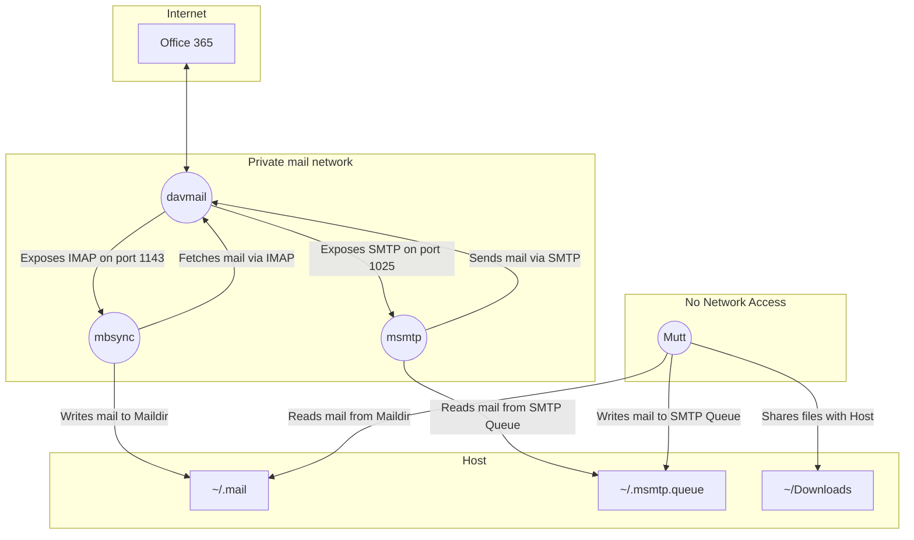

# muttpack
Running mutt and friends in a containerised sandbox

If you want to run mutt in a modern Microsoft 365 setup, and are a little paranoid about exposing old, potentially vulnerable code to nastiness that arrives by mail, this is one example way you could do that.

It limits mutt to just allowing the user to interact with mail, and breaks the tasks of sending and receiving up into other containers. This separation allows mutt to be run in a container with no networking and only filesystem access to a Maildir and sending queue.

There's also some effort to build a more secure mutt, by using modern compiler flags and disabling unneeded features.

I've based this on my own setup, which I've used extensively, but have had to heavily modify it to focus on the main thing here rather then endless mutt customisations. In some places there are placeholder configs, example configs, or just the config settings relevant for the sandbox setup. They are described below.

# Conceptual Container Overview

The containers are structured to break up the tasks for sending, receiving and interacting with mail so they can be sandboxed.



The mounts are bind mounts in this setup, to keep things synchronised if you want to run your traditional setup outside the sandbox. After you're satisfied everything is working, they can be changed to volume mounts for more isolation from the host, but if you have a large mailbox, the maildir volume will get fairly large.

## DavMail

The davmail container provides the interface between Office 365 and standard IMAP/SMTP services.

It can communicate with the Internet, and exposes it's IMAP and SMTP port over a private mail network.

## mbsync

The mbsync container fetches mail from the davmail IMAP server over the private mail network, and writes it to a Maildir folder.

## msmtp

The msmtp container handles sending mail via the davmail SMTP server over the private mail network. It has two parts. The container picks mail to be sent up from the queue file and directory. The mutt container writes the mail to be send to the queue.

## mutt

The container the user will use to interact with the mutt TUI. As it's where any malware in mail is likely to detonate it's slightly hardened in two ways.

It has no network access. It receives mail from the mbsync Maildir mount, and sends mail by writing it to the msmtp queue mount.

It has a builder to compile a more secure version of mutt to limit exploitable surface and make exploits slightly harder.

There's also a one line patch to make S/MIME with modern Outlook work for those who might struggle like me.

# Container Specific Configuration

No two mutt setups are alike. This can either be an example for you to base your own implementation on, or you can mold your setup around this.

Explaining how to setup and configure davmail, msmtp, mbsync/isync or the beast that is mutt are beyond the scope of this. Here I merely highlight configurations items specific to this setup you should be aware of.

## davmail

The simplest is to just copy your existing davmail config (typically at `~.davmail.properties`) over the current davmaiil.properties file (notice the lack of dot in the latter). If you don't have a davmail config, you can grab a copy of davmail at https://sourceforge.net/projects/davmail/ .

As davmail runs headless, you can't make use of the O365Interactive mode - which is necessary if you have 2FA requirements. Instead switch the authentication to O365Modern. As long as the refresh token is up to date, it'll work.

The validity of the refresh token is problematically long, but if you need to update it, do it using davmail on your host, then copy the refresh token key value pair into the container's config.

The refresh token config line looks something like:

```yaml
davmail.oauth.user@domain.com.refreshToken={AES}<base64 encoded token>
```

## mbsync

mbsync's configuration, while powerful, can be overcomplicated for a simple setup. The davmail host is just called "davmail" and exposes IMAP on port 1143. Connections to davmail are by default un-SSL'ed and can use any password. So make sure this port isn't exposed anywhere but this private network.

## msmtp

Similar to mbsync, the davmail host is "davmail" and the SMTP port is 1025. It also needs no TLS, plain auth and can use any password by davmail default.

The log file is written to the host's queue directory mount.

## mutt

Excluding the commonly complicated mutt setups most people use, the specifics required for the sandbox are fairly straightforward.

msmtp needs a config file, but will only use the queue functionality to write files to the sending queue mount. This makes the `logfile` setting the only relevant one.

As this is the mail in which you'll interact with the mail, you'll need to setup all your typical comforts. I've included mailcap, vim and w3m samples as examples.

The muttrc only highlights the two mount locations setup in the compose file.
