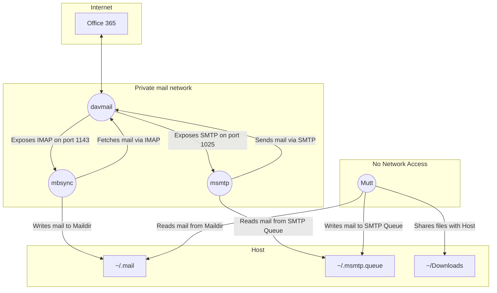

# muttpack
Running mutt and friends in a containerised sandbox

If you want to run mutt in a modern Microsoft 365 setup, and are a little paranoid about exposing old, potentially vulnerable code to nastiness that arrives by mail, this is one example way you could do that.

It limits mutt to just allowing the user to interact with mail, and breaks the tasks of sending and receiving up into other containers. This separation allows mutt to be run in a container with no networking and only file system access to a Maildir and sending queue.

There's also some effort to build a more secure mutt, by using modern compiler flags and disabling unneeded features.

I've based this on my own setup, which I've used extensively, but have had to heavily modify it to focus on the main thing here rather then endless mutt customisations. In some places there are placeholder configs, example configs, or just the config settings relevant for the sandbox setup. They are described below.

# Conceptual Container Overview

The containers are structured to break up the tasks for sending, receiving and interacting with mail so they can be sandboxed.



The mounts are bind mounts in this setup, to keep things synchronised if you want to run your traditional setup outside the sandbox. After you're satisfied everything is working, they can be changed to volume mounts for more isolation from the host, but if you have a large mailbox, the maildir volume will get fairly large.

## DavMail

The davmail container provides the interface between Office 365 and standard IMAP/SMTP services.

It can communicate with the Internet, and exposes its IMAP and SMTP port over a private mail network.

## mbsync

The mbsync container fetches mail from the davmail IMAP server over the private mail network, and writes it to a Maildir folder.

## msmtp

The msmtp container handles sending mail via the davmail SMTP server over the private mail network. It has two parts. The container picks up mail to be sent from the queue file and directory. The mutt container writes the mail to be sent to the queue.

## mutt

The mutt container is the one in which the user will interact with the mutt TUI. As it's where any malware in mail is likely to detonate it's slightly hardened in two ways.

It has no network access. It receives mail from the mbsync Maildir mount, and sends mail by writing it to the msmtp queue mount.

It has a builder to compile a more secure version of mutt to limit exploitable surface and make exploits slightly harder.

# Container Specific Configuration

No two mutt setups are alike. This can either be an example for you to base your own implementation on, or you can mold your setup around this.

Explaining how to setup and configure davmail, msmtp, mbsync/isync or the beast that is mutt are beyond this scope. Here I merely highlight configuration items specific to this setup that you should be aware of.

## davmail

The simplest method for setup is to get things working on your host, then just copy your davmail config (typically at `~.davmail.properties`) over the current davmaiil.properties file in the container (notice the lack of dot in the latter). If you don't have davmail, you can grab a copy of davmail at https://sourceforge.net/projects/davmail/ .

As davmail runs headless, you can't make use of the O365Interactive mode - which is necessary if you have 2FA requirements. Instead switch the authentication to O365Modern. As long as the refresh token is up to date, it'll work.

Microsoft's validity of the refresh token is problematically long, but if you need to update it, do it using davmail on your host, then copy the refresh token key value pair into the container's config.

The refresh token config line looks something like:

```yaml
davmail.oauth.user@domain.com.refreshToken={AES}<base64 encoded token>
```

## mbsync

mbsync's configuration, while powerful, can be overcomplicated for a simple setup. The davmail host is just called "davmail" and exposes IMAP on port 1143. Connections to davmail are by default un-SSL'ed and can use any password. So make sure not to modify things in a way that exposes this port outside this private network.

## msmtp

Similar to mbsync, the davmail host is "davmail" and the SMTP port is 1025. It also needs no TLS, plain auth and can use any password by davmail default.

The log file is written to the host's queue directory mount.

## mutt

Excluding from the discussion the commonly complicated mutt setups most people use, the specifics required for the sandbox are fairly straightforward.

msmtp needs a config file, but will only use the queue functionality to write files to the sending queue mount. This makes the `logfile` setting the only relevant one.

As this is the container in which you'll interact with the mail, you'll need to setup all your typical comforts. I've included mailcap, vim and w3m samples as examples.

The muttrc only highlights the two mount locations setup in the compose file.

# Further optimisations

## Restricting Internet Access

The davmail container has unrestricted Internet access. Restricting it with firewall rules can be complicated and messy. Instead, I experimented with creating a second isolated network, and using socat in a minimal container to bridge a specific host and port. This requires perfect knowledge of Microsoft 365's hosts and ports however, and can be fragile.

Here's an example to add to your `compose.yml`:

```
services:

  microsoft365:
    image: alpine/socat
    command: TCP-LISTEN:443,fork,reuseaddr TCP-CONNECT:outlook.office365.com:443,keepalive,retry=5
    restart: unless-stopped
    healthcheck:
      test: ["CMD", "socat", "-", "TCP4:outlook.office365.com:443"]
      interval: 10s
      timeout: 5s
      retries: 5
    networks:
      - default
       -microsoft365_network

davmail:
  ...snip...
    depends_on:
      microsoft365:
        condition: service_healthy
    networks:
      microsoft365_network:
        # This alias is necessary to override public DNS
        aliases:
          - outlook.office365.com

networks:
  microsoft365_network:
    internal: true
    driver: bridge
```

An alternative method that shares unix sockets over private volumes is discussed at https://gist.github.com/singe/3c6bde78191f1a9bd414a4d729e98f1c

## Restrict Host File System Access

The Maildir and msmtp queue are currently bind mounts to the host's filesystem. This means any compromise of those containers gives access to write files to the host. Instead these can be changes to volume mounts, to create private volumes not shared with the host. This is easier for the msmtp queue as it rarely contains much more than a few e-mails pending sending. If you have a big Maildir however, the volume can get unwieldy (see next section).

## Archive Mail Outside the Maildir

The mutt container is the most exposed, and while malware wouldn't have network access, it would still have access to all your e-mail. Rather keep a small Maildir, and archive mail outside of these containers regularly to limit the blast radius of what malware would access. Additionally, this makes managing a Maildir volume easier.

## Esoteric Architectures

Docker will use QEMU to emulate architectures that aren't native to your host. The specifics of setting it up are outside the scope of this, but you can use the `platform:` key in your compose setup for a service to specify different architectures. You can get a list of supported architectures with `docker buildx ls --no-trunc`. Given how lightweight most of these containers are, the performance overhead of emulation doesn't matter.

## Limit Persistence

My preference is to fire up a new mutt container every time I "do" mail. This limits persistence options in the container with the most opportunities for exploitation. The other container worth regularly restarting is davmail given that it both has Internet access and parses everything that comes into your Inbox.
